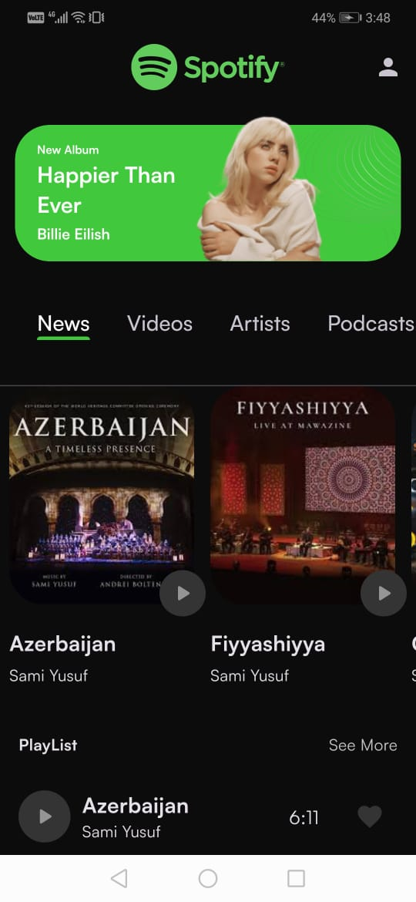
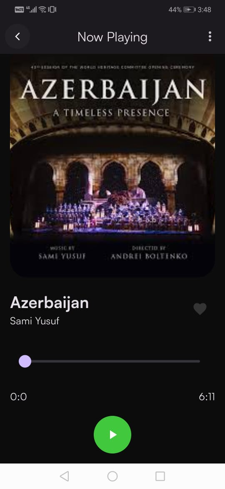
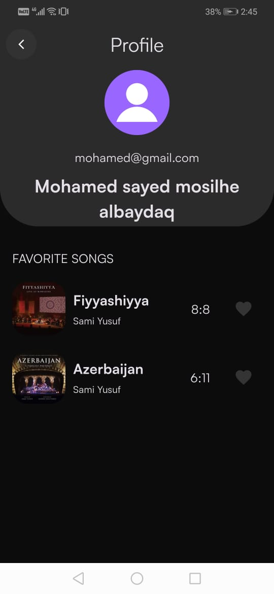
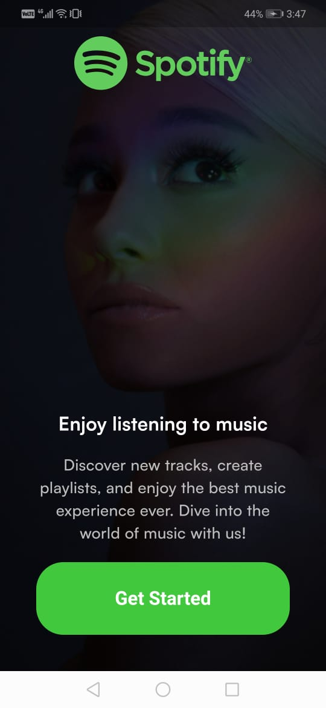
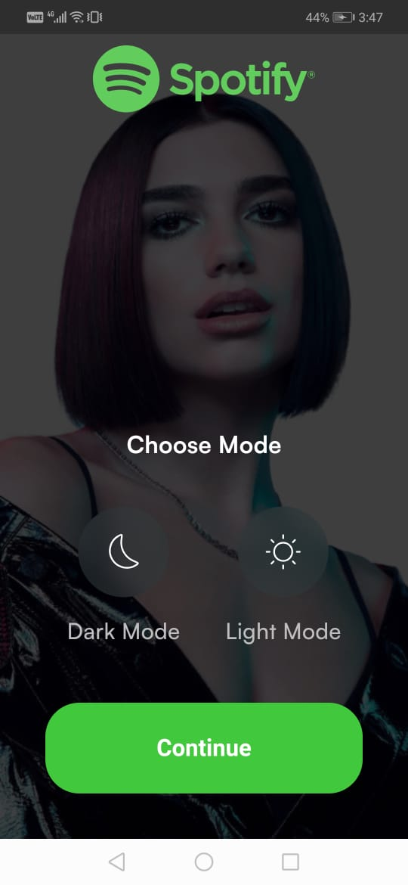
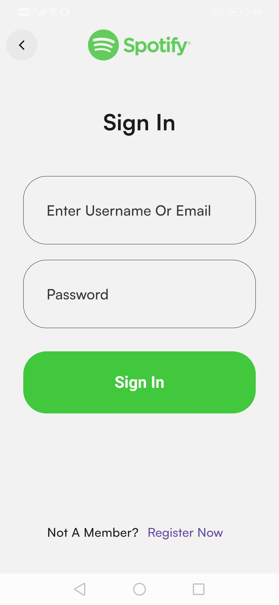
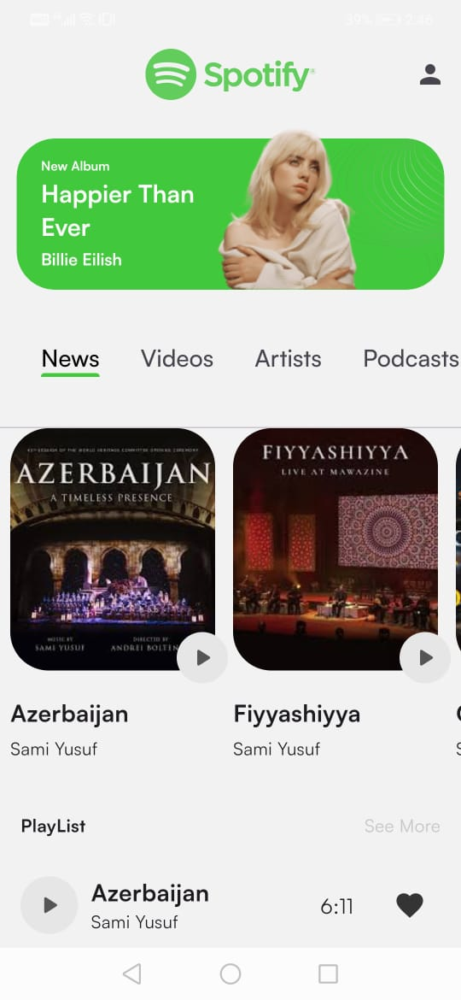
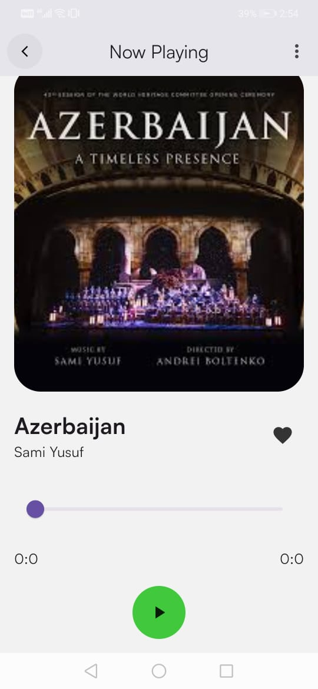
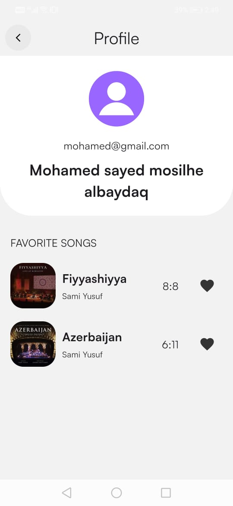

# Flutter Spotify Clone

A cross-platform music application inspired by Spotify, built to demonstrate authentication, cloud-backed music discovery, audio playback, favorites, profiles, and persistent light/dark themes in Flutter.

[View the source](https://github.com/mohamedmosilhy/Spotify)

<p>
  
  
  
</p>

## Features

- Email and password registration and sign-in
- Firestore-powered new releases and complete playlist views
- Audio streaming with play, pause, seek, and duration tracking
- Add or remove songs from a user-specific favorites collection
- Profile screen with account details and favorite tracks
- Persistent light and dark theme selection
- Splash, onboarding, authentication, home, player, and profile flows
- Responsive asset-driven interface with custom Satoshi fonts

## Architecture

The project separates responsibilities into data, domain, and presentation layers:

- `data` implements Firebase services, models, and repository classes.
- `domain` defines entities, repository contracts, and use cases.
- `presentation` contains screens, widgets, and Bloc/Cubit state.
- `service_locator.dart` registers services, repositories, and use cases with `get_it`.
- `common` and `core` contain shared widgets, theme configuration, and helpers.

Firebase Authentication manages accounts, while Cloud Firestore stores users, songs, and per-user favorite records. `just_audio` handles playback from each song's configured URL.

## Built with

- Flutter and Dart
- Firebase Core, Authentication, and Cloud Firestore
- flutter_bloc and hydrated_bloc
- just_audio
- get_it
- dartz
- flutter_svg

## Getting started

### Prerequisites

- Flutter with Dart SDK `>=3.4.3 <4.0.0`
- A Firebase project
- FlutterFire CLI for regenerating platform configuration when using your own project

### Installation

```bash
git clone https://github.com/mohamedmosilhy/Spotify.git
cd Spotify
flutter pub get
```

### Firebase configuration

The repository contains generated Firebase options, but a fork should connect its own Firebase project:

```bash
dart pub global activate flutterfire_cli
flutterfire configure
```

Enable email/password authentication and create these Firestore collections:

- `Users` for profile records
- `Songs` for track metadata such as title, artist, duration, release date, cover URL, and audio URL
- `Users/{userId}/Favorites` for documents containing a `songId`

Your Firestore security rules should restrict profile and favorite writes to the authenticated user.

### Run the app

```bash
flutter run
```

## Project structure

```text
lib/
├── common/               # Shared widgets, helpers, and favorite-button state
├── core/                 # Assets and application themes
├── data/                 # Firebase services, models, and repositories
├── domain/               # Entities, contracts, and use cases
├── presentation/         # Screens, widgets, and feature state
├── firebase_options.dart
├── service_locator.dart
└── main.dart
```

## Screens

<p>
  
  
  
  
</p>

<p>
  
  
  
</p>

## Testing and analysis

```bash
flutter analyze
flutter test
```

The included test is still the Flutter template scaffold; feature-level tests are a useful next step.
