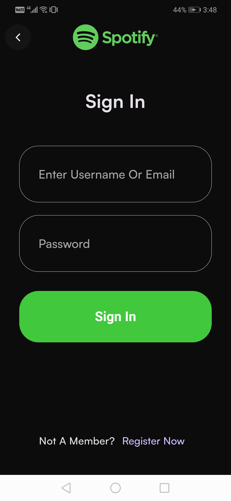

# Spotify Clone 🎶

A Flutter-based Spotify-like music streaming application.

## Features

- Project Structure
- Theme Of Application 🎨
- Assets & Fonts Folders / Defining In Pubspec
- Splash Page
- Get Started Page
- Choose Mode Page
- Choose Mode Logic
- Login Or Signup Page 🔒
- Login Page
- Signup Page
- Firebase Setup 🔥
- Auth Domain Layer
- Auth Data Layer
- Service Locator
- Using Auth Use Cases
- Upload Songs To FireStorage
- Upload Song Covers To FireStorage
- Create Cloud FireStore Collections (Songs, Users, ...)
- Home Page (Tabs, Songs, ...)
- Music Player Page
- User Profile Page (Favorite Songs)

## Screenshots

### Splash Page


### Get Started Page


### Choose Mode Page


### Register Or Signin Page


### Login Page




### Signup Page


### Home Page


### Music Player Page


### User Profile Page


## Setup Instructions

1. **Clone the repository:**

   ```bash
   git clone https://github.com/your-username/spotify-clone.git
   cd spotify-clone
   ```

2. **Install dependencies:**

   ```bash
   flutter pub get
   ```

3. **Configure Firebase:**

   - Follow the [Firebase setup instructions](https://firebase.google.com/docs/flutter/setup) for both Android and iOS.

4. **Run the app:**
   ```bash
   flutter run
   ```

## Dependencies

- Flutter SDK
- Firebase Core
- Firebase Auth
- Cloud Firestore
- Firebase Storage
- Bloc
- Equatable
- Other dependencies as listed in `pubspec.yaml`
